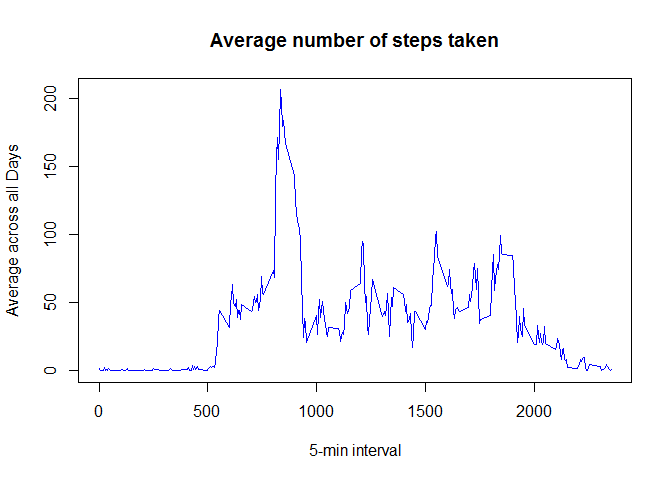

# Reproducible Research: Peer Assessment 1
## Attempt these questions, and generate your answer as a HTML file using Knitr.

## Loading and preprocessing the data

1. Load the data

```r
myData <- read.csv("C:\\Users\\Mardi\\DS2015\\RepData_PeerAssessment1\\activity.csv",header=TRUE, sep = ",")
head(myData)
```

```
##   steps       date interval
## 1    NA 2012-10-01        0
## 2    NA 2012-10-01        5
## 3    NA 2012-10-01       10
## 4    NA 2012-10-01       15
## 5    NA 2012-10-01       20
## 6    NA 2012-10-01       25
```

```r
library(lattice)
```

2. Process/transform the data (if necessary) into a format suitable for your analysis

```r
myData$date <- as.Date(myData$date, "%Y-%m-%d")
```
## What is mean total number of steps taken per day?

1. If you do not understand the difference between a histogram and a barplot, research the difference between them. Make a histogram of the total number of steps taken each day

```r
myStepsByDay <- aggregate(steps ~ date, data = myData, sum, na.rm = TRUE)
```
2. Make a histogram of the total number of steps taken each day

```r
hist(myStepsByDay$steps, main = "Total steps by day", xlab = "day", col = "blue")
```

 

3. Calculate and report the mean and median total number of steps taken per day

```r
myStepsByDayMean <- mean(myStepsByDay$steps)
##myStepsByDayMean

myStepsByDayMedian <- median(myStepsByDay$steps)
##myStepsByDayMedian
```

## What is the average daily activity pattern?

1. Make a time series plot (i.e. type = "l") of the 5-minute interval (x-axis) and the average number of steps taken, averaged across all days (y-axis)

```r
myTimeSeries <- tapply(myData$steps, myData$interval, mean, na.rm = TRUE)

plot(row.names(myTimeSeries), myTimeSeries, type = "l", xlab = "5-min interval", ylab = "Average across all Days", main = "Average number of steps taken", col = "blue")
```

 
2. Which 5-minute interval, on average across all the days in the dataset, contains the maximum number of steps?

```r
myMaxInterval <- which.max(myTimeSeries)
names(myMaxInterval)
```

```
## [1] "835"
```

## Imputing missing values

1. Calculate and report the total number of missing values in the dataset (i.e. the total number of rows with NAs)

```r
myData_NA <- sum(is.na(myData))
myData_NA
```

```
## [1] 2304
```

2. Create a new dataset that is equal to the original dataset but with the missing data filled in.

```r
myStepsAverage <- aggregate(steps ~ interval, data = myData, FUN = mean)
myFillNA <- numeric()
for (i in 1:nrow(myData)) {
    obs <- myData[i, ]
    if (is.na(obs$steps)) {
        steps <- subset(myStepsAverage, interval == obs$interval)$steps
    } else {
        steps <- obs$steps
    }
    myFillNA <- c(myFillNA, steps)
}
```

3. Create a new dataset that is equal to the original dataset but with the missing data filled in

```r
myNewData <- myData
myNewData$steps <- myFillNA
##myNewData$steps
myNewStepsByDay <- aggregate(steps ~ date, data = myNewData, sum, na.rm = TRUE)
```

4. Make a histogram of the total number of steps taken each day and Calculate and report the mean and median total number of steps taken per day. Do these values differ from the estimates from the first part of the assignment? What is the impact of imputing missing data on the estimates of the total daily number of steps?

```r
hist(myNewStepsByDay$steps, main = "Total steps by day", xlab = "day", col = "red")
```

 

```r
mean(myNewStepsByDay$steps)
```

```
## [1] 10766.19
```

```r
median(myNewStepsByDay$steps)
```

```
## [1] 10766.19
```

## Are there differences in activity patterns between weekdays and weekends?

1. Create a new factor variable in the dataset with two levels - "weekday" and "weekend" indicating whether a given date is a weekday or weekend day.

```r
myDayData <- weekdays(myData$date)
myDayLevel <- vector()
for (i in 1:nrow(myData)) {
    if (myDayData[i] == "Saturday") {
        myDayLevel[i] <- "Weekend"
    } else if (myDayData[i] == "Sunday") {
        myDayLevel[i] <- "Weekend"
    } else {
        myDayLevel[i] <- "Weekday"
    }
}
myData$myDayLevel <- myDayLevel
myData$myDayLevel <- factor(myData$myDayLevel)

myStepsByDay <- aggregate(steps ~ interval + myDayLevel, data = myData, mean)
names(myStepsByDay) <- c("interval", "myDayLevel", "steps")
```

2. Make a panel plot containing a time series plot (i.e. type = "l") of the 5-minute interval (x-axis) and the average number of steps taken, averaged across all weekday days or weekend days (y-axis). See the README file in the GitHub repository to see an example of what this plot should look like using simulated data.

```r
xyplot(steps ~ interval | myDayLevel, myStepsByDay, type = "l", layout = c(1, 2), xlab = "Interval", 
     ylab = "Number of steps")
```

 
